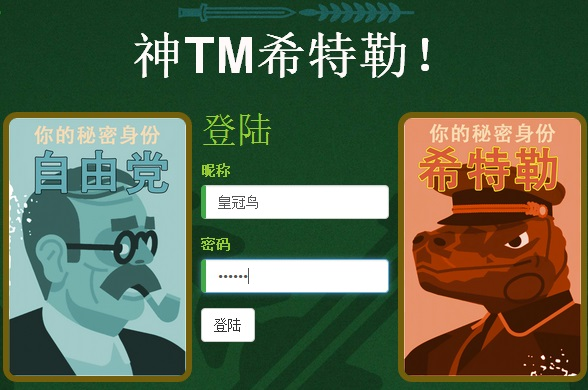
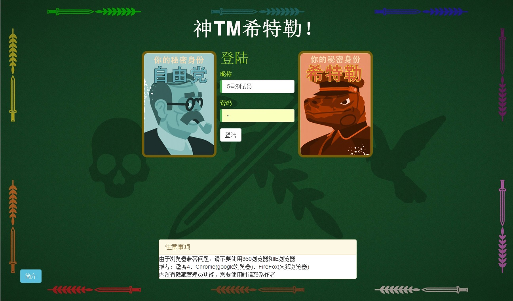
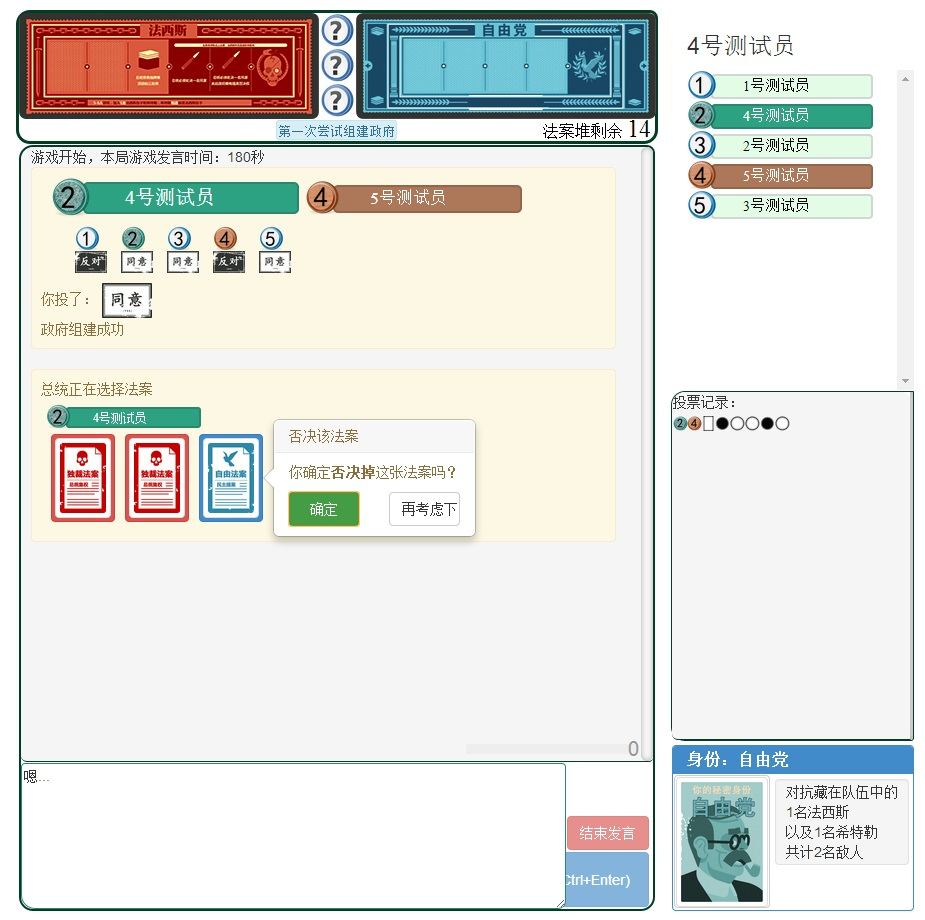
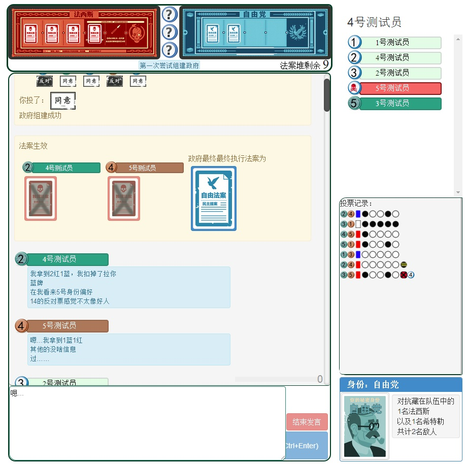
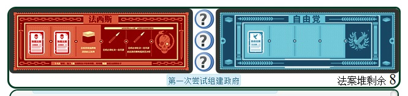
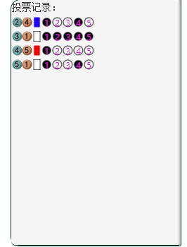

<p align="center">
  <a href="http://hk.airir.com" target="_blank">
    
  </a>
</p>

___

<p align="center">
  <a href="https://angularclass.com" target="_blank">
    
  </a>
</p>

# 网页游戏 神TM希特勒 


>  [神TM希特勒](http://hk.airir.com)

### 简介
* 基于Angular2框架的网页版桌游《解密希特勒》
* 该游戏属于身份猜测类的桌游，类似游戏有：杀人游戏，狼人杀、抵抗组织、阿瓦隆等…… 
* 网站需要即时通信，异步数据处理 
* 该项目是出于个人爱好的练习作品，本着学习angular2框架的初衷用业余时间完成的，angular2中的组件、服务、* 消息均有涉及并使用 后端使用的nodejs 
* 演示网址：hk.airir.com (首次登陆即为注册过程，需要5个玩家才可开始游戏，可多开页面)
* 个人github：[xxhgnxx](https://github.com/xxhgnxx)

```
newhitler/
├─src
│  │  custom-typings.d.ts
│  │  desk.jpg
│  │  head.jpg
│  │  index.html
│  │  main.browser.ts
│  │  polyfills.browser.ts
│  │  vendor.browser.ts
│  │  
│  ├─app
│  │  │  admin.ts
│  │  │  app.component.css
│  │  │  app.component.spec.ts
│  │  │  app.component.ts
│  │  │  app.e2e.ts
│  │  │  app.module.ts
│  │  │  app.resolver.ts
│  │  │  app.routes.ts
│  │  │  app.service.ts
│  │  │  environment.ts
│  │  │  index.ts
│  │  │  
│  │  ├─choosePlayer
│  │  │      choosePlayer.css
│  │  │      choosePlayer.html
│  │  │      choosePlayer.ts
│  │  │      index.ts
│  │  │      
│  │  ├─gameControl                       * 游戏进程控制(旧版，待废弃)
│  │  │      gameControl.component.css
│  │  │      gameControl.component.html
│  │  │      gameControl.component.ts
│  │  │      index.ts
│  │  │      
│  │  ├─gameover                           * 游戏结束过程
│  │  │      gameover.css
│  │  │      gameover.html
│  │  │      gameover.ts
│  │  │      index.ts
│  │  │      
│  │  ├─hgnContainer                        * 自定义的容器
│  │  │      hgnContainer.css
│  │  │      hgnContainer.html
│  │  │      hgnContainer.ts
│  │  │      index.ts
│  │  │      
│  │  ├─hgnCP                               * 玩家选择过程
│  │  │      hgnCP.css
│  │  │      hgnCP.html
│  │  │      hgnCP.ts
│  │  │      index.ts
│  │  │      
│  │  ├─hgnforce                            * 强制生效过程
│  │  │      hgnforce.css
│  │  │      hgnforce.html
│  │  │      hgnforce.ts
│  │  │      index.ts
│  │  │      
│  │  ├─hgnlookpro                          * 查看法案过程
│  │  │      hgnlookpro.css
│  │  │      hgnlookpro.html
│  │  │      hgnlookpro.ts
│  │  │      index.ts
│  │  │      
│  │  ├─hgnPlayer                           * 玩家标签
│  │  │      hgnPlayer.css
│  │  │      hgnPlayer.html
│  │  │      hgnPlayer.ts
│  │  │      index.ts
│  │  │      
│  │  ├─hgnVote                             * 投票过程
│  │  │      hgnVote.css
│  │  │      hgnVote.html
│  │  │      hgnVote.ts
│  │  │      index.ts
│  │  │      
│  │  ├─hgnvotelist                         * 投票记录
│  │  │      hgnvotelist.css
│  │  │      hgnvotelist.html
│  │  │      hgnvotelist.ts
│  │  │      index.ts
│  │  │      
│  │  ├─invPlayer                           * 查看身份过程
│  │  │      index.ts
│  │  │      invPlayer.css
│  │  │      invPlayer.html
│  │  │      invPlayer.ts
│  │  │      
│  │  ├─login                               * 登陆过程
│  │  │      index.ts
│  │  │      login.component.css
│  │  │      login.component.html
│  │  │      login.component.ts
│  │  │      tmp.html
│  │  │      
│  │  ├─msg                                 * 文字消息，游戏历史记录界面
│  │  │      index.ts
│  │  │      msg.component.css
│  │  │      msg.component.html
│  │  │      msg.component.ts
│  │  │      
│  │  ├─pipe                                * 小型管道(待废弃)
│  │  │      getHeadPope.ts
│  │  │      getRole.ts
│  │  │      getvote.ts
│  │  │      
│  │  ├─preSelect                           * 选择总统过程
│  │  │      index.ts
│  │  │      preSelect.css
│  │  │      preSelect.html
│  │  │      preSelect.ts
│  │  │      
│  │  ├─room                                * 游戏房间界面
│  │  │      index.ts
│  │  │      room.component.css
│  │  │      room.component.html
│  │  │      room.component.ts
│  │  │      
│  │  ├─services
│  │  │      data.ts                         * 数据包结构(待修改)
│  │  │      game.service.ts                 * 游戏进程服务
│  │  │      index.ts
│  │  │      msg.service.ts                  * 本地消息记录
│  │  │      network.ts                      * 网络通讯(socket.io)
│  │  │      socket.service.ts               * 主控制服务(几乎全部的业务逻辑都在这里)
│  │  │      user.service.ts                 * 用户服务
│  │  │      user.ts                         * User结构
│  │  │      vote.ts                         * 投票器
│  │  │      
│  │  ├─toKill                               * 枪决过程
│  │  │      index.ts
│  │  │      toKill.css
│  │  │      toKill.html
│  │  │      toKill.ts
│  │  │      
│  │  ├─userslist                            * 用户列表
│  │  │     index.ts
│  │  │     userslist.component.css
│  │  │     userslist.component.html
│  │  │     userslist.component.ts
│  │  │      
│  │  └─util
│  │          index.ts
│  │          randomString.ts
│  │        
│  ├─assets
│  │  ├─css
│  │  └─img
│  ├─css
│  ├─meta
│  └─pic
└─typings
```
# 界面截图
  
  
  
  
  
```

# 主要技术使用
* [angular2-webpack-starter](https://github.com/AngularClass/angular2-webpack-starter)
* node.js
  * server端
  (https://github.com/xxhgnxx/servernew)
* 使用方法和其他相关依赖请查阅
  * [package.json](https://github.com/xxhgnxx/tionic2/blob/master/package.json)